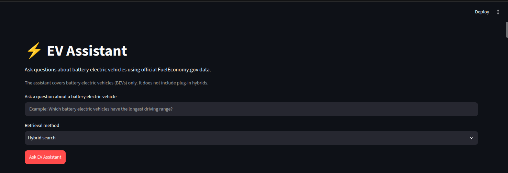
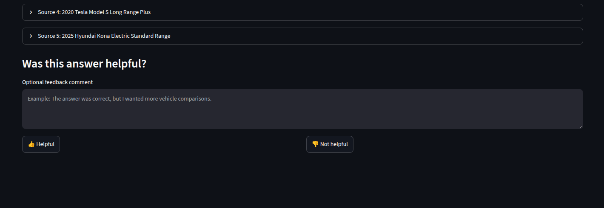
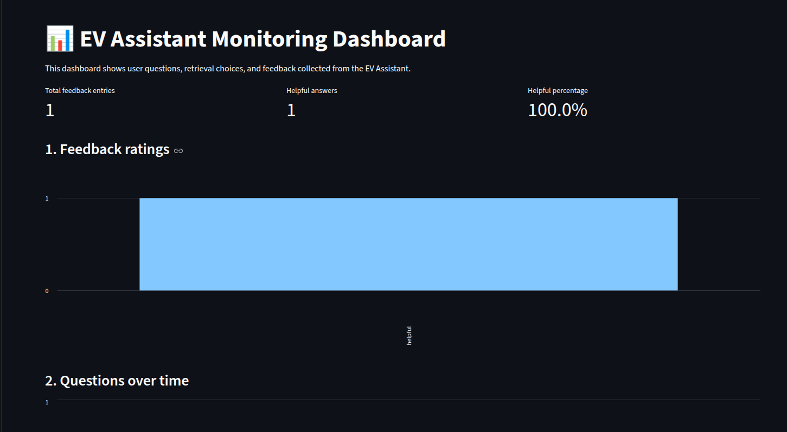
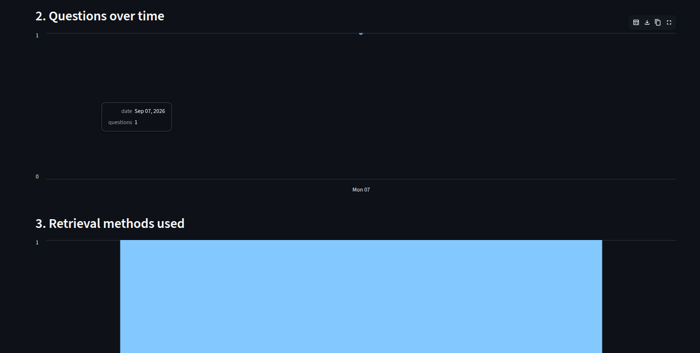
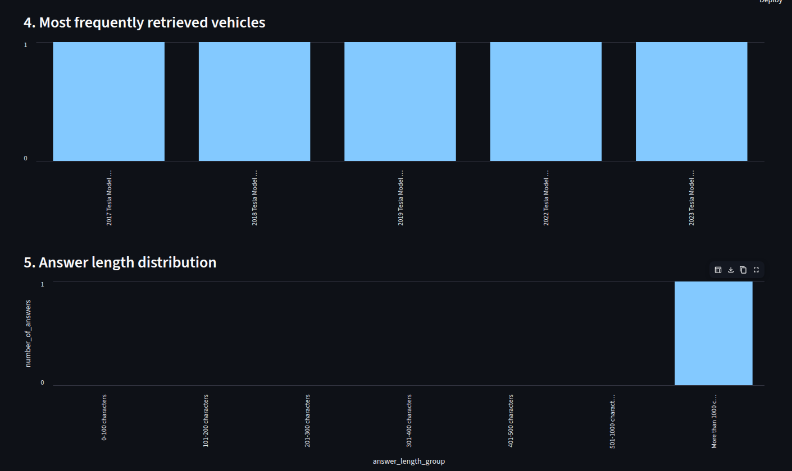

# EV Assistant: Battery Electric Vehicle RAG Application

EV Assistant is a Retrieval-Augmented Generation (RAG) application that answers questions about **Battery Electric Vehicles (BEVs)**.

The application uses official FuelEconomy.gov vehicle data. Users can ask questions in natural language about electric range, MPGe efficiency, charging time, drive type, vehicle class, and other available BEV specifications.



---

## 1. Problem Description

Choosing a battery electric vehicle can be difficult because users need to compare many specifications, including:

- Electric driving range
- MPGe efficiency
- Level 2 charging time
- Vehicle class
- Drive type
- Electric motor details
- Annual energy cost

The official FuelEconomy.gov dataset contains this information, but the dataset is a large CSV file and is not easy to search using normal conversational questions.

EV Assistant solves this problem by allowing users to ask questions such as:

- What is the electric range of the Tesla Model 3?
- Which battery electric vehicles have the longest driving range?
- Which BEVs have the highest combined MPGe?
- Which electric cars have all-wheel drive?
- What electric SUVs have long range?
- Which BEVs have short Level 2 charging times?

The application retrieves relevant BEV records from Elasticsearch and provides them as context to an OpenAI model. The OpenAI model generates a final answer based only on the retrieved FuelEconomy.gov records.
---

## Data

Source: [FuelEconomy.gov downloadable data](https://www.fueleconomy.gov/feg/download.shtml)

Dataset used:

```text
https://www.fueleconomy.gov/feg/epadata/vehicles.csv.zip
```

The processing script filters the dataset to retain only BEVs where:

```text
fuelType = Electricity
fuelType1 = Electricity
fuelType2 is empty
```

Important fields include:

```text
year, make, model, vehicle class, drive type,
electric range, city MPGe, highway MPGe,
combined MPGe, charging time, electric motor
```

---

## How It Works

```text
FuelEconomy.gov vehicles.csv
            |
            v
    pandas data cleaning
            |
            v
   Battery Electric Vehicles only
            |
            v
Sentence Transformers embeddings
all-MiniLM-L6-v2 (384 dimensions)
            |
            v
      Elasticsearch index
      - text search
      - vector search
      - hybrid search
            |
            v
        Retrieved BEV records
            |
            v
       OpenAI GPT model
            |
            v
     Grounded final answer
            |
            v
      Streamlit web interface
            |
            v
 Feedback CSV + monitoring dashboard
```

### Technologies

- Python
- uv
- pandas
- Elasticsearch
- sentence-transformers: `all-MiniLM-L6-v2`
- OpenAI
- Streamlit
- Docker Compose

---

## Retrieval Methods

The application supports three retrieval methods:

1. **Text search**: Elasticsearch keyword search.
2. **Vector search**: semantic similarity search using `all-MiniLM-L6-v2` embeddings.
3. **Hybrid search**: combines text and vector retrieval using Reciprocal Rank Fusion (RRF).

---

## Evaluation

Three retrieval methods were evaluated:

- Text search
- Vector search
- Hybrid search

Evaluation questions were generated from real BEV records and manually reviewed. Each question has a correct FuelEconomy.gov vehicle ID.

Metrics:

- **Hit Rate@5**: checks whether the correct vehicle appears in the top 5 results.
- **MRR@5**: rewards retrieval methods that rank the correct vehicle closer to rank 1.

| Retrieval method | Hit Rate@5 | MRR@5 |
|---|---:|---:|
| Text search | 1.0 | 1.0 |
| Vector search | 0.86 | 0.63 |
| Hybrid search | 0.53 | 0.34 |


Evaluation files:

```text
data/evaluation/retrieval_ground_truth.csv
data/evaluation/retrieval_results.csv
data/evaluation/retrieval_summary.csv
```

---

## LLM Evaluation

I compared two prompts using the same five questions and retrieved BEV records.

Each answer was scored on four criteria:

- Correctness
- Grounding in the retrieved context
- Source citation
- Clarity

Each criterion received 0 or 1 point, for a maximum score of 4.

| Prompt | Average score |
|---|---:|
| Basic prompt | 2.8 |
| Grounded prompt | 4.0 |

The grounded prompt performed better because it required source citations
and instructed the model to clearly state when information was unavailable.
The final application uses the grounded prompt.

---

## Interface and Monitoring

The Streamlit interface lets users:

- Ask BEV questions
- Select text, vector, or hybrid retrieval
- View answers and retrieved sources
- Submit helpful/not-helpful feedback
- Add optional comments




Feedback is saved to:

```text
data/feedback/feedback.csv
```

The monitoring dashboard shows feedback metrics, questions over time, retrieval method usage, frequently retrieved vehicles, and answer-length distribution.





---

## How to Run

### 1. Clone the repository

```bash
git clone https://github.com/[YOUR-USERNAME]/ev-assistant-rag.git
cd ev-assistant-rag
```

### 2. Install dependencies

```bash
uv sync
```

### 3. Add your OpenAI API key

```bash
cp .env.example .env
```

Add your key to `.env`:

```env
OPENAI_API_KEY=your_openai_api_key
OPENAI_CHAT_MODEL=gpt-4o-mini
ELASTICSEARCH_URL=http://localhost:9200
ELASTICSEARCH_INDEX=ev-vehicles
```

### 4. Download and process the data

```bash
uv run python scripts/download_data.py
uv run python src/data_processing.py
```

### 5. Start Elasticsearch

```bash
docker compose up -d elasticsearch
```

### 6. Ingest BEV documents

Open and run all cells in:

```text
notebooks/02_ingest_elasticsearch.ipynb
```

This creates embeddings and indexes the BEV documents into Elasticsearch.

Check the document count:

```bash
curl "http://localhost:9200/ev-vehicles/_count?pretty"
```

### 7. Start the application

```bash
uv run streamlit run app/streamlit_app.py
```

Open:

```text
http://localhost:8501
```

### 8. Start the monitoring dashboard

In another terminal:

```bash
uv run streamlit run app/dashboard.py --server.port 8502
```

Open:

```text
http://localhost:8502
```

---

## Docker Compose

To start Elasticsearch, the EV Assistant, and the dashboard:

```bash
docker compose up --build -d
```

Services:

| Service | URL |
|---|---|
| EV Assistant | http://localhost:8501 |
| Dashboard | http://localhost:8502 |
| Elasticsearch | http://localhost:9200 |

> After starting Elasticsearch for the first time, run `notebooks/02_ingest_elasticsearch.ipynb` to add BEV documents to the index.

---

## Course Rubric Coverage

| Requirement | Implementation |
|---|---|
| Problem description | BEV information assistant |
| Retrieval flow | Elasticsearch + OpenAI |
| Retrieval evaluation | Text, vector, hybrid search with Hit Rate@5 and MRR@5 |
| Interface | Streamlit application |
| Ingestion pipeline | Data-processing script and ingestion notebook |
| Monitoring | Feedback collection and Streamlit dashboard |
| Containerization | Docker Compose |
| Reproducibility | `uv.lock`, `.env.example`, setup instructions |
| Best practice | Hybrid search using RRF |